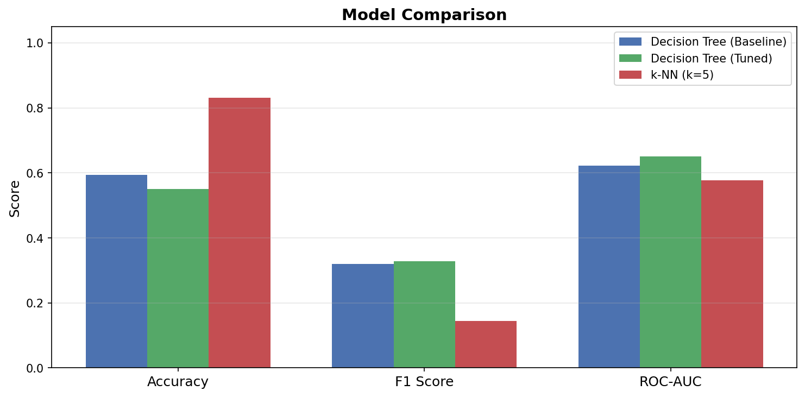
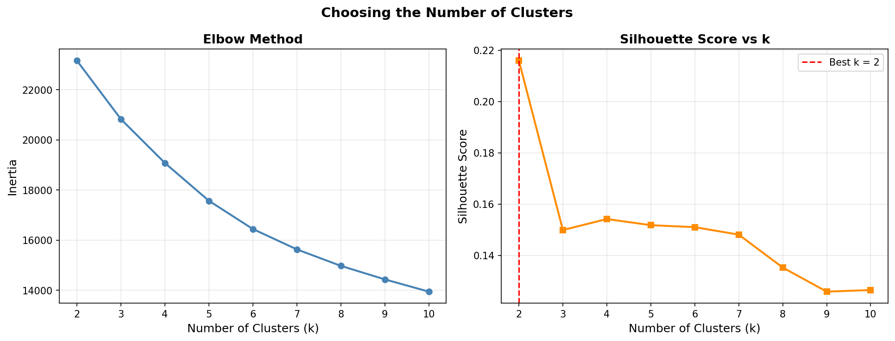
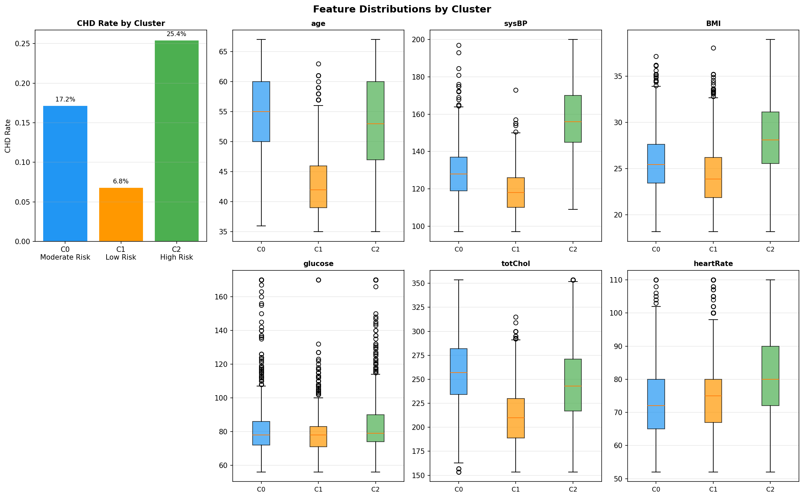
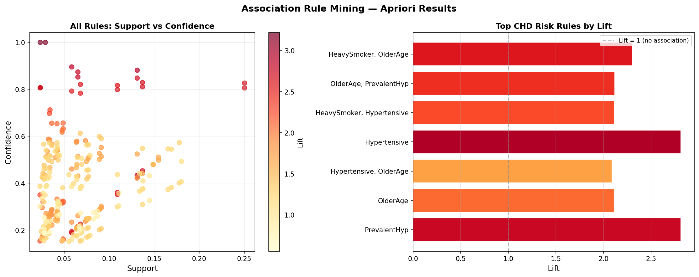
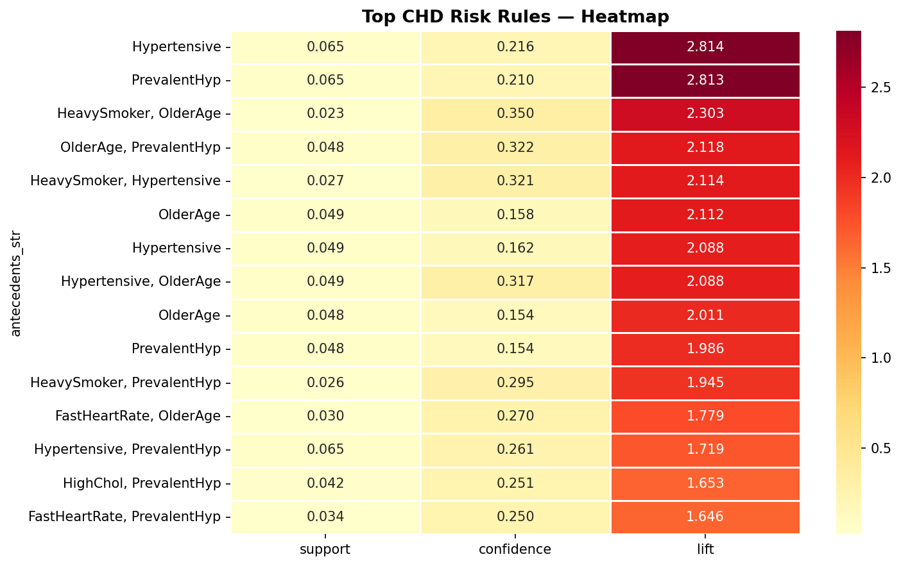

# Laxmi Kanth Oruganti
## MSCS-634 : Advanced Big Data and Data Mining
## Project Deliverable 3: Classification, Clustering, and Pattern Mining

**University:** University of the Cumberlands  
**Dataset:** Framingham Heart Study  
**Source:** [Kaggle – aasheesh200/framingham-heart-study-dataset](https://www.kaggle.com/datasets/aasheesh200/framingham-heart-study-dataset)

---

## Overview

This deliverable continues from Deliverables 1 and 2, applying three distinct data mining techniques to the Framingham Heart Study dataset (4,240 patient records, 16 features). The goal is to predict 10-year coronary heart disease (CHD) risk using classification models, discover natural patient groupings through clustering, and extract co-occurring health risk patterns using association rule mining.

The target variable for classification is `TenYearCHD` — a binary outcome (0 = no CHD, 1 = CHD). One challenge I had to deal with upfront is that the dataset is imbalanced: only about 15% of patients developed CHD. This meant that accuracy alone would be misleading, so I focused on F1 score and ROC-AUC as my primary metrics.

---

## Feature Engineering (Carried Over from Deliverable 2)

The same preprocessing and feature engineering steps from Deliverables 1 and 2 are replicated at the start of the notebook for consistency.

| Feature | Description |
|---|---|
| `log_glucose` | log1p(glucose) — addresses right skew |
| `log_cigsPerDay` | log1p(cigsPerDay) — handles zero-inflation and skew |
| `age_squared` | age² — captures non-linear age–risk relationship |
| `hypertension_risk_score` | Composite normalized score combining age, BMI, totChol, diabetes, prevalentHyp |
| `pulse_pressure` | sysBP − diaBP — added here because sysBP is now a predictor, not the target |

**Note on `pulse_pressure`:** This feature was excluded in Deliverable 2 because `sysBP` was the regression target there — including it would have caused leakage. Here the target is `TenYearCHD`, so pulse pressure is a valid and clinically meaningful predictor.

---

## Part 1 — Classification

### Models

| Model | Accuracy | F1 Score | ROC-AUC |
|---|---|---|---|
| Decision Tree (Baseline) | 0.5943 | 0.3202 | 0.6224 |
| Decision Tree (Tuned) | 0.5507 | 0.3280 | 0.6511 |
| k-NN (k=5) | 0.8314 | 0.1437 | 0.5779 |

**Best GridSearchCV parameters for Decision Tree:** `criterion='entropy'`, `max_depth=3`, `min_samples_leaf=5`, `min_samples_split=10`

### Visualizations

#### 1. Decision Tree Visualization


**Analysis:** The tuned Decision Tree uses only 3 levels of depth with entropy as the splitting criterion. The top splits are driven by `age`, `sysBP`, and `pulse_pressure`, which aligns with known cardiovascular risk factors. The shallow tree avoids overfitting while still capturing the most important decision boundaries. Using `class_weight='balanced'` helped the tree pay more attention to the minority class (CHD=1) during training.

---

#### 2. k-NN: Finding the Best k


**Analysis:** I tested odd values of k from 3 to 29 using 5-fold stratified cross-validation (`StratifiedKFold`) scored on F1. The curve peaks around k=5, after which the F1 score gradually levels off or declines. Using `weights='distance'` ensures that closer neighbors contribute more to predictions, which is especially useful in a dataset where CHD and non-CHD patients overlap in feature space.

---

#### 3. Confusion Matrices


**Analysis:** The Decision Tree's confusion matrix reflects its use of `class_weight='balanced'` — it catches more actual CHD cases (higher recall for the positive class) at the cost of more false positives. The k-NN matrix tells the opposite story: high accuracy but most CHD cases are predicted as No CHD (low recall for class 1). This is a good example of how accuracy is misleading on imbalanced data. The Decision Tree is the more practically useful model here because catching actual CHD cases matters more than keeping false positives low.

---

#### 4. Feature Importance — Decision Tree


**Analysis:** The top features identified by the tuned Decision Tree are `age`, `sysBP`, `pulse_pressure`, and `hypertension_risk_score`. These align with what clinical guidelines say about cardiovascular risk. Features like `log_cigsPerDay`, `diabetes`, and `currentSmoker` appear lower in importance — not because they are irrelevant, but because in the presence of stronger predictors the tree routes most decisions through age and blood pressure first.

---

#### 5. Model Comparison



**Analysis:** The tuned Decision Tree outperforms k-NN on both F1 and Reciever Operating Characteristic (ROC) - Area Under the Curve(AUC), which are the metrics that matter for this imbalanced problem. k-NN's high accuracy (0.83) is inflated by the class imbalance — it mostly predicts the majority class. The Decision Tree's lower accuracy but higher F1 and AUC makes it the better choice for a clinical screening tool where missing true CHD cases has real consequences.

---

## Part 2 — Clustering (K-Means)

K-Means was applied to 7 numeric health features (`age`, `sysBP`, `diaBP`, `BMI`, `totChol`, `glucose`, `heartRate`) without using the CHD label at all.

**Final model:** k=3, Silhouette Score = 0.1496

| Cluster | Risk Level | CHD Rate | Approximate Profile |
|---|---|---|---|
| Cluster 1 | Low Risk | 6.8% | Younger patients, lower BP and BMI |
| Cluster 0 | Moderate Risk | 17.2% | Middle-aged, moderately elevated values |
| Cluster 2 | High Risk | 25.4% | Older patients, higher BP, BMI, glucose |

### Visualizations

#### 6. Elbow Method and Silhouette Score



**Analysis:** Both the elbow curve and silhouette scores pointed toward k=3 as the best choice. The elbow shows a noticeable change in slope around k=3, and the silhouette score peaks there before declining. I chose k=3 also because three groups are much easier to interpret and communicate in a health context than a larger number of clusters.

---

#### 7. Cluster Profiles Heatmap


**Analysis:** The heatmap shows the average feature value for each cluster. The high-risk cluster has consistently elevated values for blood pressure, glucose, and age. The low-risk cluster shows the opposite pattern. Total cholesterol is relatively similar across all three groups, which suggests it is less useful on its own for separating patients into risk categories compared to blood pressure and age.

---

#### 8. K-Means PCA Visualization


**Analysis:** PCA reduced the 7 clustering features to 2 dimensions, capturing enough variance to visualize the cluster boundaries. The left plot shows the three K-Means clusters; the right shows actual CHD outcomes overlaid on the same projection. What I found interesting is that even though clustering was done without the CHD label, the high-risk cluster has noticeably more actual CHD cases (red dots) concentrated in its region. This validates that the feature-based grouping does capture real risk differences.

---

#### 9. Feature Distributions by Cluster (Box Plots)



**Analysis:** The box plots confirm the cluster profiles quantitatively. The CHD rate bar chart shows a clear gradient from low (6.8%) to high (25.4%) risk. Age and sysBP show the most pronounced separation between clusters — the high-risk cluster has consistently higher medians and less overlap with the other groups. Glucose shows the most spread within clusters, which is expected given its higher variability in the original data.

---

## Part 3 — Association Rule Mining (Apriori)

Numeric features were binarized into clinically meaningful flags (e.g., `Hypertensive` = sysBP ≥ 140, `OlderAge` = age ≥ 55). The Apriori algorithm was run with `min_support=0.02` and `min_confidence=0.15`.

**Results:**
- Frequent itemsets: 86 (11 single, 30 pairs, 45 triples)
- Total rules generated: 259
- CHD-specific rules (consequent = CHD_Risk): 28

**Top CHD risk rules by lift:**

| Antecedent | Confidence | Lift |
|---|---|---|
| Hypertensive | 0.216 | 2.814 |
| PrevalentHyp | 0.210 | 2.813 |
| HeavySmoker + OlderAge | 0.350 | 2.303 |
| OlderAge + PrevalentHyp | 0.322 | 2.118 |
| HeavySmoker + Hypertensive | 0.321 | 2.114 |
| Hypertensive + OlderAge | 0.317 | 2.088 |

### Visualizations

#### 10. Association Rules Scatter and Bar Chart



**Analysis:** The scatter plot shows support vs. confidence for all 259 rules, colored by lift. Rules involving blood pressure and hypertension history tend to cluster in the upper-right region — higher confidence and higher lift. The bar chart on the right shows the top 10 CHD-specific rules by lift. The strongest single-factor rule is `Hypertensive → CHD_Risk` (lift 2.81), meaning patients with active hypertension develop CHD at nearly three times the rate you would expect by chance.

---

#### 11. ARM Heatmap — Top CHD Rules



**Analysis:** The heatmap gives a quick visual read of the top 15 CHD risk rules across support, confidence, and lift together. Rules involving combinations — `HeavySmoker + OlderAge`, `Hypertensive + OlderAge`, `FastHeartRate + PrevalentHyp` — tend to have higher lift even if their absolute support is lower. This reinforces the idea that CHD risk is typically driven by multiple co-occurring conditions rather than any single factor.

---

## Key Insights

### Classification
1. **Class imbalance is the biggest challenge.** With only 15% positive cases, F1 and ROC-AUC are far more informative than accuracy. k-NN's 83% accuracy is misleading — it almost never identifies actual CHD cases.

2. **The tuned Decision Tree is more useful in practice.** GridSearchCV improved the AUC from 0.622 to 0.651, and the shallower tree (`max_depth=3`) generalizes better. The top predictors — age, sysBP, and pulse pressure — are consistent with AHA cardiovascular risk guidelines.

3. **k-NN works well when the positive class is reasonably represented, but struggles here.** Even with distance weighting, the model is dominated by the non-CHD majority. For future work, applying SMOTE or adjusting the decision threshold could help.

### Clustering
4. **K-Means found clinically meaningful patient groups without using the CHD label.** The three clusters map onto a clear Low → Moderate → High risk gradient (6.8%, 17.2%, 25.4% CHD rates). This is a good sign that the selected health features capture enough of the underlying variation to be useful for patient segmentation.

5. **Blood pressure and age are the most cluster-discriminating features.** Total cholesterol was relatively uniform across clusters, which is something I did not expect going in.

### Pattern Mining
6. **CHD risk comes from combinations, not single factors.** Rules like `HeavySmoker + OlderAge → CHD_Risk` (lift 2.30) show that compound risk is higher than any individual factor alone. This could guide clinical screening to prioritize patients with multiple co-occurring conditions.

7. **Hypertension is the most predictive single flag.** `Hypertensive → CHD_Risk` had the highest lift among single-antecedent rules (2.81), showing that active high blood pressure is strongly associated with CHD risk in this dataset. `PrevalentHyp` is a close second, suggesting long-term hypertension history adds independent predictive signal beyond current BP readings.

---

## Real-World Applications

The findings from this deliverable have direct applications in preventive cardiology:

- **Risk stratification:** The K-Means clusters could be used to stratify patients in a clinical setting and allocate resources — patients in the high-risk cluster could receive more frequent monitoring or earlier intervention.
- **Clinical decision support:** The association rules could inform alert systems that flag patients presenting with multiple co-occurring risk factors (e.g., older + hypertensive + heavy smoker) for CHD screening.
- **Population health management:** The Apriori patterns reveal which combinations of conditions are most predictive, which could help public health campaigns target the right groups.

---

## Challenges and How I Addressed Them

| Challenge | How I Addressed It |
|---|---|
| Class imbalance (~85/15 split) | Used `class_weight='balanced'` in Decision Tree; used F1 and ROC-AUC instead of accuracy |
| Choosing the right k for both k-NN and K-Means | Used cross-validation F1 for k-NN; elbow + silhouette methods for K-Means |
| Association rules producing too many trivial results | Filtered to only rules where `CHD_Risk` is the consequent; sorted by lift to surface the meaningful ones |
| Low silhouette score for K-Means | Expected given overlapping health measurements; validated clusters via CHD rate difference instead of relying solely on silhouette |

---

## Preprocessing (Replicated from Deliverables 1 & 2)

The same preprocessing pipeline is applied at the start of the notebook:
1. **Missing value imputation** — median for numeric columns, mode for categorical (`education`, `BPMeds`)
2. **Duplicate detection** — no duplicates found
3. **Outlier detection (IQR)** and **treatment (1st–99th percentile Winsorization via `pandas.Series.clip()`)**
4. **Feature engineering** — 5 derived features (4 from D2 + new `pulse_pressure`)

645 missing values were imputed; 707 outlier instances were capped across 8 numeric columns.

---

## Notebook Structure

The notebook (`MSCS_634_Project_Deliverable3.ipynb`) is organized into 8 sections:

| Section | Content |
|---|---|
| 1. Introduction | Overview, objectives, target variable definition |
| 2. Library Imports | pandas, numpy, scikit-learn, mlxtend, matplotlib, seaborn |
| 3. Load Dataset | CSV load, shape and dtype inspection |
| 4. Preprocessing | Imputation, duplicate check, IQR + Winsorization, feature engineering |
| 5. Classification | Decision Tree (baseline + tuned), k-NN (k selection + final model), confusion matrices, ROC curves, feature importance, model comparison |
| 6. Clustering | Feature selection, k selection (elbow + silhouette), K-Means (k=3), cluster profiles, PCA visualization, box plots |
| 7. Association Rule Mining | Binarization, Apriori, rule generation, CHD-specific rules, scatter + bar + heatmap |
| 8. Summary | Printed results summary across all three techniques |

---

## Repository Structure

```
MSCS_634_ProjectDeliverable_3/
├── Visualizations/
│   ├── 1_dt_tree_visualization.png
│   ├── 2_knn_k_selection.png
│   ├── 3_confusion_matrices.png
│   ├── 4_feature_importance.png
│   ├── 5_model_comparison.png
│   ├── 6_kmeans_elbow_silhouette.png
│   ├── 7_cluster_profiles.png
│   ├── 8_kmeans_pca.png
│   ├── 9_cluster_boxplots.png
│   ├── 10_association_rules.png
│   └── 11_arm_heatmap.png
├── framingham.csv                              ← Raw dataset (download from Kaggle)
├── MSCS_634_Project_Deliverable3.ipynb         ← Main analysis notebook
└── README.md                                    ← This file
```

---

## How to Run

1. Download `framingham.csv` from [Kaggle](https://www.kaggle.com/datasets/aasheesh200/framingham-heart-study-dataset)
2. Place `framingham.csv` in the same folder as the notebook
3. Install required libraries:
   ```bash
   pip install pandas numpy matplotlib seaborn scikit-learn mlxtend
   ```
4. Open the notebook and run **Kernel → Restart & Run All**
5. All 11 visualizations will be saved automatically to the `Visualizations/` folder

> **Google Colab users:** Uncomment the `files.upload()` block in the dataset loading cell to upload the CSV.

---

## References

Levy, D. (1999). *50 Years of Discovery: Medical Milestones from the National Heart, Lung, and Blood Institute's Framingham Heart Study*. Center for Bio-Medical Communication.

Agrawal, R., & Srikant, R. (1994). Fast algorithms for mining association rules. *Proceedings of the 20th International Conference on Very Large Data Bases (VLDB)*, 487–499.

Rashidi, H. H., et al. (2020). Artificial intelligence and machine learning in pathology: The present landscape of supervised methods. *Academic Pathology*, 6, 2374289519873088.

### Clinical References

| Feature / Guideline | Reference |
|---|---|
| `sysBP`, `diaBP`, CHD risk | James, P. A., et al. (2014). 2014 Evidence-Based Guideline for the Management of High Blood Pressure in Adults (JNC 8). *JAMA, 311*(5), 507–520. |
| `totChol` | American Heart Association. (2023). *What Your Cholesterol Levels Mean*. |
| `BMI` | World Health Organization. (2021). *Obesity and Overweight*. |
| `glucose`, diabetes threshold | American Diabetes Association. (2023). *Diagnosis and Classification of Diabetes*. |
| `heartRate` | American Heart Association. (2022). *Tachycardia: Fast Heart Rate*. |
| Smoking and CHD | Centers for Disease Control and Prevention. (2023). *Smoking and Cardiovascular Disease*. |
